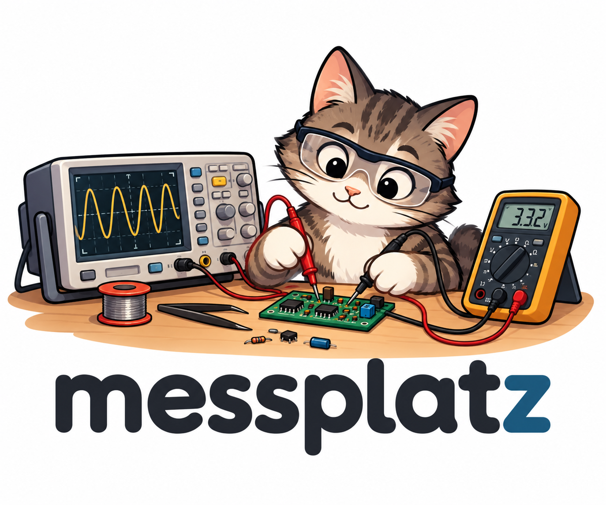

<p align="center">
  
</p>

A Python package for controlling lab instruments (oscilloscopes, multimeters, signal generators) over USB, LAN and Bluetooth.


## Getting Started

Install for development:

```bash
pip install -e .[dev]
```

Run tests:

```bash
pytest
```

### First Measurement


Read the waveform on screen from a UNI-T UPO1000HD oscilloscope (USB) and plot it:

```python
from matplotlib import pyplot as plt
from messplatz.devices.osci.upo1000hd import UPO1000HD

scope = UPO1000HD()
print(scope.info)                       # UNI-TREND TECHNOLOGY,UPO1084HD,...

time, voltage = scope.get_waveform(channel=1)

plt.figure(figsize=(15, 3))
plt.plot(time, voltage)
plt.xlabel("Time (s)")
plt.ylabel("Voltage (V)")
plt.show()

scope.close()
```
